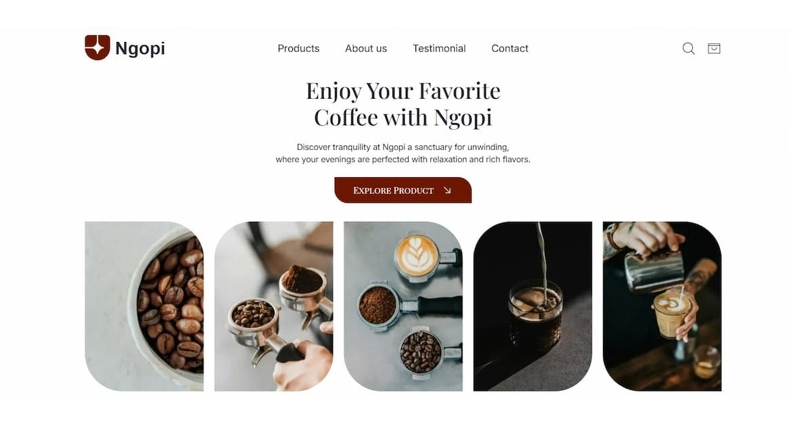

# Coffeeshop Landing Page

In this project I use Tailwind CSS to build this landing page inspired by a design taken from figma. 

[Live preview](https://coffee-landing-shop.pages.dev/)

## Features
- Fully responsive
- Touchable slider
- Dropdown menu

## Original Design
[layout](https://github.com/erme07/shoesLandingPage/blob/477f711d4798b129ddc9d35b1e4d2c0e621e3f5d/layout.jpg)

## Acknowledgement
Thanks to [Misbachul Umam](https://www.figma.com/@misbachulumam) for the [design](https://www.figma.com/community/file/1349589616476884317/coffeshop-landing-page-ngopi-web-design)
